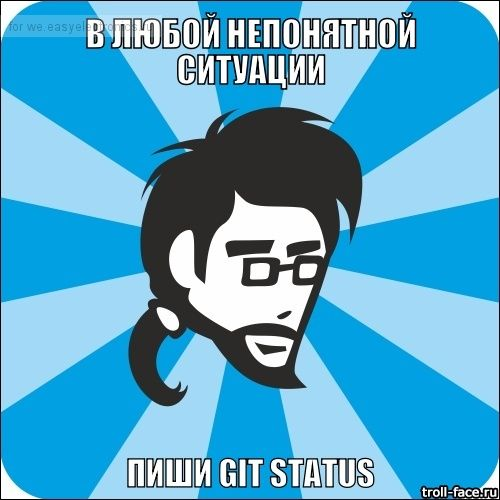
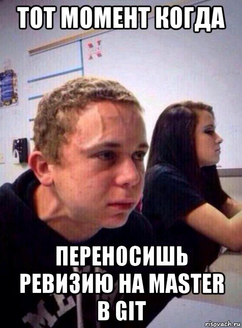

# WELCOME TO GIT

## Основные команды Git 1-го Семинара

> **git init** - создание локального *репозитория*.

> **git status** - получить информацию от git о его текущем состоянии.

> **git add** - добавить файл или файлы к следующему коммиту

> **git log** - смотрим жернал изменений

> **git diff** - изменения между коммитами - 

> **git checkout** – переход от одного коммита к другому (через команду git log находим нужный коммит )

> **git commit -m** - создание коммита. добавляем -am в том случае если ранее был add.

> **git checkout master** - переход к актуальной версии. для проверки ветки master or main пишем git branch.

## Стили текста ~~не~~ бывают *разные*

 * **полужирнй**

 * *курсив*

 * ***полужирный курсив***

 # Вопрос: 
 1. ## не получилось подчеркнуть ##

## Основные команды Семинара 2 и создание конфликта

> **git merge --abort** - отменить слияние, которое прошло с конфликтом

> **git checkout  -b <название ветки>** - создание ветки и переход к ней

> **git log --graph** - вывод на экран истории всех коммитов с их хеш-кодами в древовидной форме

> **git commit -am “message”** – добавление файлов в отслеживание и       создание коммита. при условии что была команда git add.

> **git branch** – посмотреть список веток в репозитории

> **git log --oneline** – коротенький журнал

> **git branch -d <название ветки>** – удалить ветку

> **git checkout <название ветки>** – переход к другой ветке

> **git branch <название ветки>** – создать новую ветку

# Комментарий: Создал 4 ветки, далее сделал слияние с веткой master. Создал несколько конфликтов и разрешил их.

Внесены изменения через сайт github

